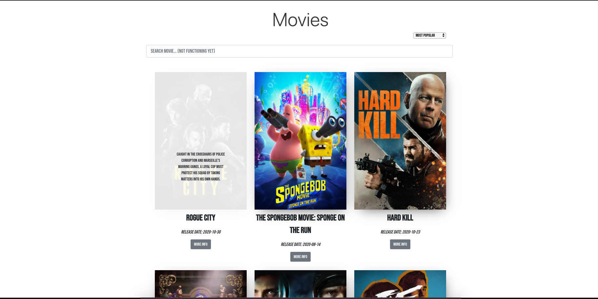

# MovieHub

### Try the app here: [MovieHub](#)

## About

MovieHub is an app built with React that uses [The Movie DB API](https://developers.themoviedb.org) to fetch movie data which renders the most popular, highest rated, recently released and upcoming movies depending on which filter was chosen.

## To be added features:

- Search Function
- Give user the ability to rate a film

## Run locally

1. cd my-app
2. change .envSAMPLE to .env
3. Open .env and paste TheMovieDb API key in: "REACT_APP_API_KEY"
4. npm start

## Preview

